 

---

<h3><code>sai@github ~ $ ./contributions.sh</code></h3>

 

<h3><code>sai@github ~ $ whoami</code></h3>

<table>
  <tr>
    <td valign="top" align="center">
      
<code>sai@github ~ $ cat this-is-me.raw</code>

      
    </td>
    <td valign="top" align="center">
      
<code>sai@github ~ $ neofetch --specs</code>

      
        
      
    </td>
  </tr>
</table>

 

---

<h3><code>sai@github ~ $ cat stack.sys</code></h3>

 

  

---

 

  

